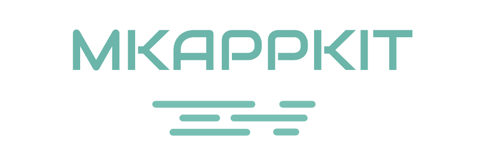

# MKAppKit | iOS Crash Guard, Launch Monitor & UI Components

CocoaPods library for iOS: runtime crash protection (KVO/KVC/unrecognized selector/containers), launch performance monitoring, loading animations, radial menu, and email autocomplete TextField. Objective-C + Swift.

Keywords: ios crash guard, cocoapods ios, launch monitor, kvo crash protection, ios ui components, objective-c swift library

## Quick Start

```ruby
pod 'MKAppKit/MKCrashGuard'
pod 'MKAppKit/MKLaunchMonitor'
```

```objc
[MKCrashGuardManager executeAppGuard];
[MKCrashGuardManager registerCrashHandle:self];
```

Requires iOS 9.0+. Run `pod install` after updating your Podfile.

Component docs: [doc/](doc/).


[](http://cocoapods.org/pods/MKAppKit)
[](http://cocoapods.org/pods/MKAppKit)
[](http://cocoapods.org/pods/MKAppKit)





## Crash 守护组件：MKCrashGuard

| 组件 | 添加方式 | 语言 | 备注 |
| --- | --- | --- | --- |
| [crash 防护组件 v1.1](https://github.com/mythkiven/MKAppKit/blob/master/doc/MKCrashGuard.md) | `pod 'MKAppKit/MKCrashGuard' ` | Objective-C   | 守护类型：KVO、KVC、unrecognized selector、NStimer、NSNotification、UINavigationController、NSUserDefaults、NSCache、以及：NSString,NSArray,NSDictonary,NSAttributedString,NSSet 和对应的 5 种可变容器类型
| 守护的范围持续更新中.. |  |  |

## 性能监控组件： MKMonitor 系列

| 组件 | 添加方式 | 语言 | 备注 |
| --- | --- | --- | --- |
| [启动监控组件 v1.0](https://github.com/mythkiven/MKAppKit/blob/master/doc/MKMonitor.md) |  `pod 'MKAppKit/MKLaunchMonitor' ` | Objective-C   | 包含代码打点工具等
| 其他性能组件陆续添加中.. |  |  |


## UI 组件

| 组件 | 添加方式 | 语言 | 效果 |
| --- | --- | --- | --- |
| [圆环进度 + tableview 组合的加载数据动画 v1.0](https://github.com/mythkiven/MKAppKit/blob/master/doc/MKCombineLoadingAnimation.md) |  `pod 'MKAppKit/MKCombineLoadingAnimation' ` | Objective-C   | 
| [MKDiffuseMenu: 点击散开的动画效果 v1.0](https://github.com/mythkiven/MKAppKit/blob/master/doc/MKDiffuseMenu.md) |  `pod 'MKAppKit/MKDiffuseMenu' ` | swift5.0   | 
| [输入 @ 自动下拉邮箱列表 v1.0](https://github.com/mythkiven/MKAppKit/blob/master/doc/MKDropdownMailTF.md) |  `pod 'MKAppKit/MKDropdownMailTF' ` |  Objective-C | 
| UI 还是以前的版本，暂无更新计划 |  |  |


**使用**

```
添加 pod 时，如遇到错误：Unable to find a specification for `MKAppKit`
请更新 repo：
$ pod repo update
```


