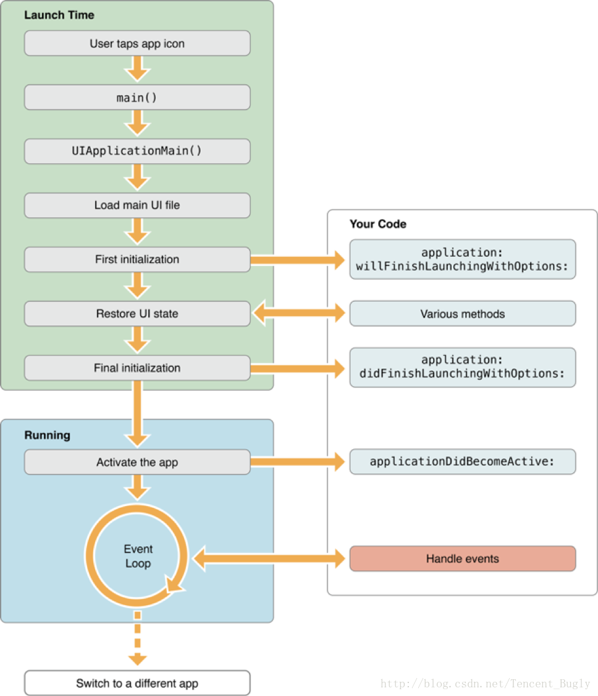

### MKMonitor 性能监控包含如下几部分

- MKEnergyMonitor：电量监控
- MKNetworkMonitor：网络流量监控
- MKRenderMonitor：渲染帧率监控
- MKCPUMonitor：CPU 监控
- MKMemoryMonitor：内存监控
- MKCrashMonitor：卡顿监控
- MKLaunchMonitor：app 启动监控
- MKCrashMonitor：crash 监控

### 性能监控途径

- 1、Xcode 自带的 Instrument

Xcode 自带的 Instrument 工具包含了很多强大的检测 功能：CPU、内存、磁盘、网络、卡顿、耗电等等，开发过程中可以使用这些工具辅助调试 App。

- 2、使用三方 SDK。

一些三方 SDK，像听云，OneAPM，Bugly 等利用 swizzle 方法进行 AOP 处理，在关键函数之前和之后自动埋点记录上报。使用起来会比较方便，最大的缺点就是安全性，这些 SDK 统计到的数据可能就是商业机密，并且也不清楚有没有统计其他信息。所以最好的方式就是自己实现相关的监控功能。

### 1、启动监控:MKLaunchMonitor

启动分冷启动和热启动，热启动是 App 从 Background 到 Active，这个我们不关心，冷启动才是目前需要测量的重要数据。

冷启动分为两阶段: pre-main 阶段 (点击图标 ->main) 和 main 阶段 (main->applicationDidBecomeActive)。

###### pre-main 阶段

pre main() 这个时间， 一般控制在 400ms 以内。iOS10 之后，可以在 Xcode 的 Edit Scheme->Run->Environment Variables 中增加 `DYLD_PRINT_STATISTICS` 环境变量, value=1 来测量这个时间。当前工具库暂时没发监控这个数据。

###### main()->applicationDidBecomeActive()
这个时间我这里定义是： main() 的第一行代码到 applicationDidBecomeActive() 最后一行代码。可以使用代码打点(`MKAppKit/MKLaunchMonitor/MKPointWatch`)的方式直接记录这个时间。

### 2、CUP监控：MKCPUMonitor 

sss、、

主线程阻塞超过 400 毫秒就会让用户感知到卡顿

参考：

- iOS 性能监控 SDK —— Wedjat（华狄特）开发过程的调研和整理  https://github.com/aozhimin/iOS-Monitor-Platform
- https://www.itslide.com/slide/275520/

流量监控去掉NSURLProtocol对于WKWebView的支持,因为出于性能的原因，post 请求 body 数据被清空 （encode 的时候 HTTPBody 和 HTTPBodyStream 这两个字段被丢弃掉了）。参考苹果源码https://github.com/WebKit/webkit/blob/fe39539b83d28751e86077b173abd5b7872ce3f9/Source/WebKit2/Shared/mac/WebCoreArgumentCodersMac.mm#L61-L88 。及bug report: https://bugs.webkit.org/show_bug.cgi?id=138169。 from https://mp.weixin.qq.com/s/rhYKLIbXOsUJC_n6dt9UfA
### 相关工具

- [检测项目中未使用的图片](https://github.com/tinymind/LSUnusedResources)
- [检测项目中未使用的类](https://github.com/dblock/fui)

** 参考 **
- [dyld 与 ObjC](https://blog.cnbluebox.com/blog/2017/06/20/dyldyu-objc/)
- [WWDC2016 Optimizing App Startup Time](https://developer.apple.com/videos/play/wwdc2016/406/)
- [WWDC2017 App Startup Time: Past, Present, and Future](https://developer.apple.com/videos/play/wwdc2017/413)